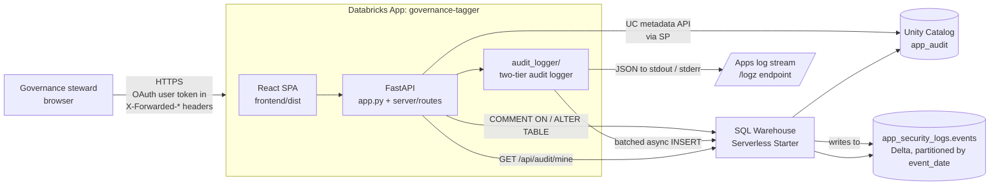

# Architecture


## Bundle tree

```
governance-tagger/
├── README.md                       Project overview and deploy steps
├── ARCHITECTURE.md                 This document
├── LOGGING.md                      Reusable security-logging pattern
├── app.yaml                        Apps runtime config (command, env vars)
├── requirements.txt                Python dependencies for the Apps runtime
├── .gitignore                      Excludes for sync
├── app.py                          FastAPI entry point; lifespan starts the
│                                   audit writer, mounts /api router, serves
│                                   the built React SPA from frontend/dist.
├── server/
│   ├── __init__.py
│   ├── config.py                   IS_DATABRICKS_APP detection, SP and OBO
│   │                               WorkspaceClient factories, UserContext.
│   ├── audit_logger/               Two-tier audit logger (Python
│   │                               package). Public API: start(), stop(),
│   │                               log_event(...), SecurityEvent, EventType.
│   │                               Drop into any other Databricks App to reuse.
│   ├── uc.py                       Thin UC accessor: list_catalogs,
│   │                               list_schemas, list_tables, describe_table,
│   │                               update_table_comment, update_column_comment,
│   │                               list_recent_audit_events.
│   └── routes/
│       ├── __init__.py
│       └── api.py                  FastAPI routes. Each endpoint pulls a
│                                   UserContext from headers, wraps the call
│                                   in try/except, and logs both success and
│                                   failure events.
└── frontend/
    ├── package.json                React + Vite dependencies
    ├── vite.config.ts              Dev proxy /api -> :8000, build to dist/
    ├── tsconfig.json
    ├── index.html
    ├── src/
    │   ├── App.tsx                 Single-page UI: domain dropdown, table
    │   │                           list, edit form, audit panel.
    │   ├── main.tsx                React root.
    │   └── styles.css              Databricks-styled CSS (red accent).
    └── dist/                       Built artifacts (uploaded with sync).
```

## Request flow



### Two identities

The app authenticates with two distinct identities:

1. **App service principal** (`<APP_SP_CLIENT_ID>`).
   Databricks auto-injects `DATABRICKS_CLIENT_ID` / `DATABRICKS_CLIENT_SECRET`
   into the App runtime. The SP is the *actor* for every UC mutation
   (`COMMENT ON TABLE`, `ALTER TABLE ... ALTER COLUMN COMMENT`) and every
   audit-table write. The SP needs `USE CATALOG`, `USE SCHEMA`, `SELECT`,
   `MODIFY` on each target schema, plus `MODIFY` on the audit table.

2. **End-user identity** (OBO). Databricks Apps forwards the user's OAuth
   token in `X-Forwarded-Access-Token` plus their email in
   `X-Forwarded-Email`. We extract the email/user-id and stamp it onto
   every audit event so the security team can answer "who did this?" in
   one query. The user OAuth scope set is intentionally minimal (`sql`)
   so the consent prompt is short and approvable for non-technical
   stewards. **The SP — not the user — performs the actual UC writes.**
   We chose this trade-off over per-user UC writes because requesting
   `unity-catalog` scope from every governance steward would block
   adoption, and the centralized audit table preserves the actual human
   actor anyway.

## Databricks features used

| Feature | How this app uses it |
|---|---|
| **Databricks Apps** | Hosts FastAPI + React SPA, auto-injects SP creds, forwards user OAuth token. |
| **Unity Catalog metadata APIs** | `catalogs.list`, `schemas.list`, `tables.list` via the SDK drive the cascading catalog → schema → tables dropdowns. UC enforces permissions uniformly. |
| **UC table & column comments** | The thing the app actually edits. Written via `COMMENT ON TABLE` and `ALTER TABLE ... ALTER COLUMN COMMENT`. |
| **SQL Warehouse** | Serverless Starter warehouse attached as an app resource; used for both UC reads and audit writes via `databricks-sql-connector`. |
| **Delta Lake** | Audit table is a partitioned Delta table at `app_audit.app_security_logs.events`. |
| **OBO user auth** | User OAuth token forwarded by the Apps platform; surfaced in headers; user email captured in every audit event. |
| **App service principal** | Auto-injected credentials used for SP-context UC writes and audit-table inserts. |
| **app.yaml resources** | `sql-warehouse` resource declared; `DATABRICKS_WAREHOUSE_ID` env var pinned for clarity. |
| **/logz endpoint** | Tier 1 of the audit logger emits structured JSON to stdout/stderr; visible at `<app-url>/logz`. |

## Trust boundaries

1. **Browser → App backend**: HTTPS terminated by the Apps platform.
   Cookies are HTTP-only and host-scoped (`__Host-databricksapps=...`).
2. **App backend → UC**: SP credentials are env-var-injected; never
   exposed to the browser; redacted in logs (the SDK redacts them
   automatically — verified in `/logz`).
3. **User identity**: extracted from `X-Forwarded-*` headers stamped by
   the Apps platform; the app never trusts a user-supplied identity in
   the request body.
